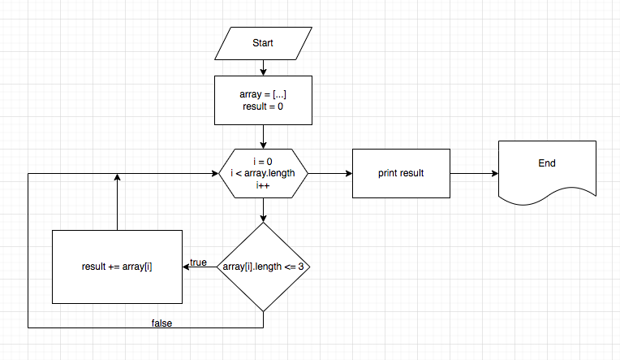

# GeekBrains
### Итоговая проверочная работа

## Задача:
Написать программу, которая из имеющегося массива строк формирует массив
из строк, длина которых меньше либо равна 3 символам. Первоначальный
массив можно ввести с клавиатуры, либо задать на старте выполнения алгоритма

## Решение:
1. Вычисляем количество элементов в исходном массиве, которые соответствуют требованиям.
2. Создаем новый пустой массив result с длиной вычесленной на прошлом шаге.
3. Заполняем массив result подходящими элементами.

## Блок схема алгоритма:
